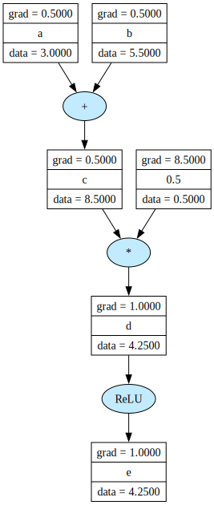
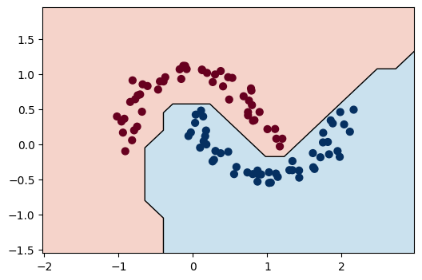

# pocketgrad

<a href="https://github.com/didarulilm/pocketgrad/actions/workflows/ci.yml"></a>

A minimal, pedagogical implementation of an autograd engine and neural network library in pure Python. Built to understand from first principles how frameworks like PyTorch implement reverse-mode automatic differentiation (aka autograd / backpropagation) under the hood. 

Thanks to Andrej Karpathy for [micrograd](https://github.com/karpathy/micrograd), which served as the primary reference for this project.

## Installation

```bash
pip install pocketgrad
```

## Example with Computational Graph
In `pocketgrad`, each operation dynamically adds a node to the computation graph, forming a [DAG](https://en.wikipedia.org/wiki/Directed_acyclic_graph). Calling `.backward()` traverses this graph in reverse topological order, accumulating gradients at each node via the chain rule.

The example below demonstrates this by building a simple graph, running backpropagation, and visualizing the result:

```python
from pocketgrad.engine import Scalar
from pocketgrad.visualize import draw_graph

a = Scalar(3.0, label="a")
b = Scalar(5.5, label="b")

c = a + b;    c.label = "c"
d = c / 2;    d.label = "d"
e = d.relu(); e.label = "e"

e.backward()
draw_graph(e)
```

<p align="left">
  
</p> 

## Training a Neural Network

The notebook `demo_mlp.ipynb` provides an end-to-end example of training a simple 2-layer feed-forward MLP with the `pocketgrad.nn` module on the classic two-moons dataset, achieving 100% accuracy. The plot below visualizes the decision boundary learned by the model:

 

## Architecture

```text
pocketgrad/
├── .github/
│   └── workflows/
│       └── ci.yml              # CI workflow
├── docs/
│   ├── decision_boundary.png   
│   └── graph.svg              
├── pocketgrad/
│   ├── __init__.py             # Package exports
│   ├── engine.py               # Core autograd engine
│   ├── nn.py                   # Neural network modules
│   └── visualize.py            # Graph rendering utilities
├── test/
│   └── test_engine.py          # Unit tests
├── .gitignore                  
├── .python-version             
├── LICENSE                     
├── README.md                   
├── demo_graph.ipynb            # Graph demo notebook
├── demo_mlp.ipynb              # MLP demo notebook
└── pyproject.toml              # Build configuration
```

## Key Design Decisions

- **Faithful to the educational goal:** `pocketgrad` stays scalar-valued by design. This keeps the computation graph easier to reason about and makes the chain rule visible at every step.
- **Batteries included for learning:** Features a small neural network library built on top of the core engine, along with graph visualization utilities for inspecting gradient flow.
- **Clarity over complexity:** It preserves the transparency that makes [micrograd](https://github.com/karpathy/micrograd) valuable for learning, without introducing extra complexity that does not bring PyTorch-level performance.

## Not in Scope

As a pedagogical tool, the following are not planned:

- Vectorization.

- PyTorch-level abstractions for tensors.

- GPU acceleration, CUDA support, or low-level kernel optimizations.


## Tests

If you are using [uv](https://docs.astral.sh/uv/), you can sync the dependencies and run the test suite with:

```bash
uv sync
uv run -m pytest
```

Or from an active Python environment:

```bash
python -m pytest
```

## License

MIT 
